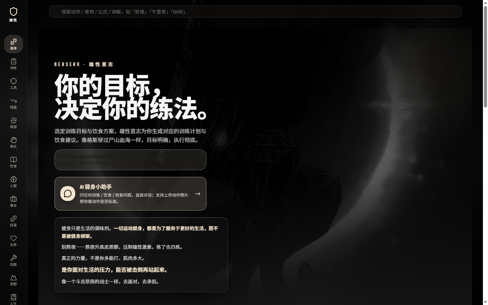
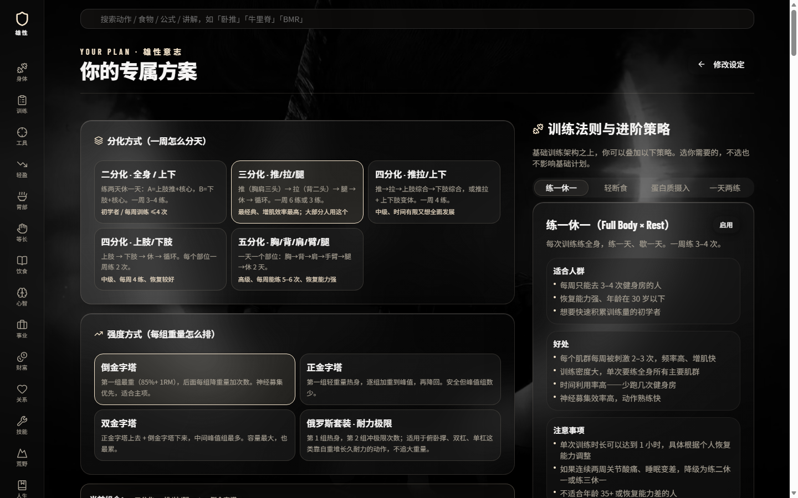
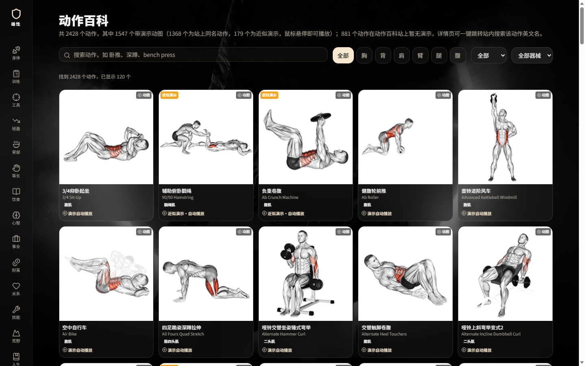
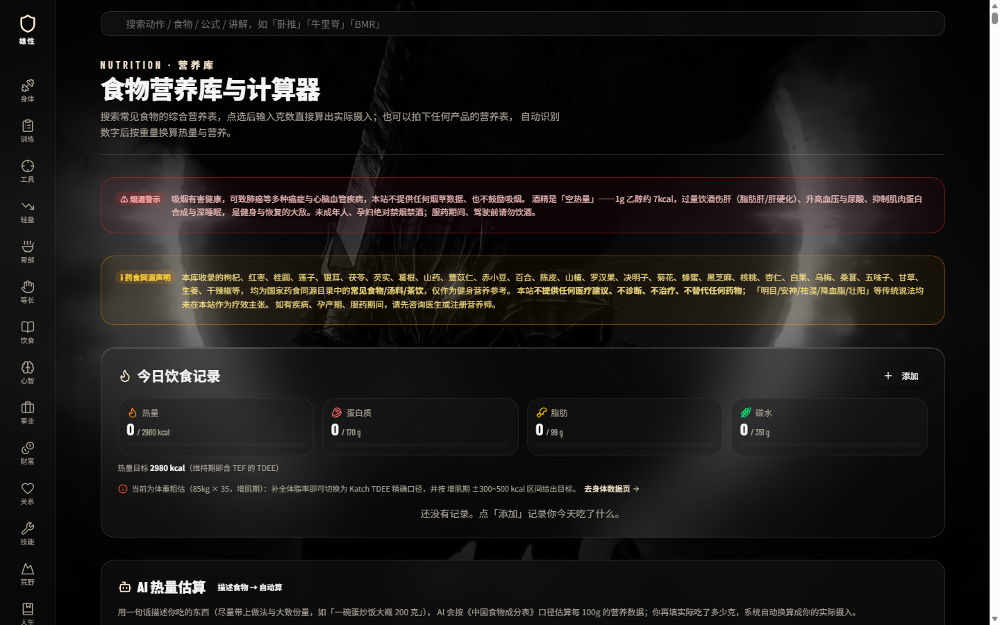
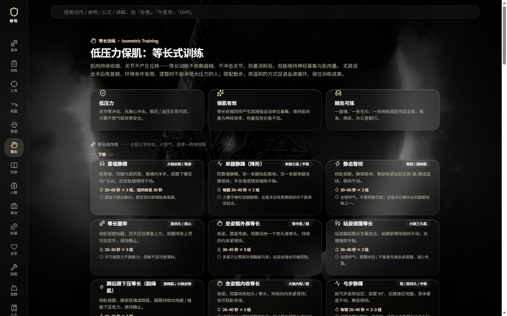

# 雄性意志 (Xiongzhi Will)

> 给自然训练者的一套健身训练 + 营养 + 动作百科系统。免费、开源、无广告、无需登录。

**在线体验：** https://hf5060ti.github.io/xiongzhi-will/ （GitHub Pages 直接打开，手机 / 电脑通用）

**对外主页：** https://hf5060ti.github.io/xiongzhi-will/landing.html



---

## 为什么是"雄性意志"

一套 **React + TypeScript** 构建的纯前端健身应用，打开即用、数据全存本地。没有广告、没有会员墙、没有"卖课"——只有把训练和营养讲明白的工具。

和市面健身 App 的区别，一句话：**动作库更大、专项更深、数据透明、完全免费**。

| 对比 | 雄性意志 | 常见健身 App |
|---|---|---|
| 动作百科 | **2428 个动作**（中文名 + 目标肌群 + 器械 + 演示动图 / 视频） | 几百个为主 |
| 专项深度 | **斗腕 84 个动作**、等长训练 42 个、术后恢复方案 | 几乎没有专项 |
| 营养 | 200+ 食物营养表 + **24 种健身补剂库**（独立分类，不混热量） | 收费会员 |
| 收费 | **免费开源**（Apache-2.0） | 订阅制为主 |



---

## 核心功能

### 训练
- **5 类训练目标**：肌肥大 / 斗腕 / 大力士 / 综合体能 / 街头健身，每类含频率、分化、周安排、动作参数、进步法则
- **经典计划模板**：新手全身 ×3、推拉腿 PPL ×6、上下肢 ×4、五分化 ×5、力量举 5×5、斗腕专项、徒手+等长适应、减脂 HIIT——每个含每周安排与动作清单（组 × 次）
- **动作百科 /library**：**2428 个动作**，中英文搜索、8 大分类筛选（力量 / 大力士 / 举重 / 爆发力 / 拉伸 / 有氧 / 斗腕 / 全部）、部位 / 器械筛选；外站演示动图失败自动重试、回退静态图
- **力量等级计算器 /strength**：**39 项动作**（含农夫行走、六角杠硬拉、臀举等），选性别 / 年龄 / 体重 + 动作，填重量 × 次数（或直接填 1RM），自动估算 1RM 并判定「入门 ★ → 精英 ★★★★★」五档，给出离下一档还差多少公斤，以及该动作五档对应的绝对重量表
- **斗腕专项**：**84 个动作**——Rise 挺腕、Cup 杯握、Top Roll 翻腕、Hook 钩手、Back Pressure 后压力、肩旋内拉钩、尺偏专项、指屈闭合、桌面对抗等长等桌面力量体系
- **等长训练页 /isometric**：**42 个动作**按 6 部位分组；**眼科 / 术后恢复四阶段方案**（不憋气、不低头、强度递进）+ 散步搭配



### 营养
- **食物营养库**：200+ 常见食物，12 大分类，每 100g 热量 / 蛋白质 / 脂肪 / 碳水 / 纤维 / 钠 / 维生素 / 矿物质 / 活性成分；嘌呤特别提醒（海鲜、动物内脏）
- **健身补剂库（独立分类）**：**24 种补剂**——肌酸、咖啡因、乳清蛋白、钙（液体钙 / 固体钙）、镁、锌、维生素 D3、鱼油、氨糖、甜菜根粉、辅酶 Q10、番茄红素等，每种含作用 / 常见剂型 / 剂量 / 时机 / 优缺点 / 注意事项 / 循证强度，**不按食物热量计算**
- **今日饮食记录**：选食物 + 克数自动统计热量与三大营养素，按餐次分组
- **一日三餐方案**：按身体数据 + 目标 + 饮食方案生成每日目标与四餐搭配，精确到克
- **AI 热量估算**：拍照 / 描述食物自动估算每百克营养
- **营养素吸收提示**：脂溶性维生素、血红素铁、草酸抑制钙吸收等



### 身体数据与工具
- **身体数据**：BMR（4 公式）、TDEE、FFMI 肌肉量上限、IPF 力量等级、1RM 换算、蛋白质按训练年限分级
- **训练记录**：逐组「重量 × 次数」录入、周容量统计、1RM 自动估算
- **分享卡**：生成墨黑 × 香槟金竖版训练分享图（Canvas）
- **冷兵器消耗**：剑道 / 唐刀 / 苗刀 / 长枪等每小时热量估算
- **饮食讲解**：低碳 / 生酮 / 碳循环等主题的循证科普



---

## 设计

- **配色**：墨黑 `#1C1C1C` × 香槟金 `#F7E7CE`——沉稳、克制、耐看
- **字体**：展示字 + 正文双层排版
- **响应式**：桌面 / 平板 / 手机自适应（移动端适配持续优化中）
- **性能**：动作卡片按页渲染，避免一次性渲染 2400+ 卡片卡顿

---

## 技术栈

- **React 19 + TypeScript**
- **Vite 8** 构建
- **Tailwind CSS 4** + shadcn/ui
- **react-router-dom** 路由（BrowserRouter；桌面离线版因 `file://` 限制仍用 HashRouter）
- **界面多语言**：简体中文 / English / Русский / Deutsch，切换即时生效（导航与界面文案；动作名、食物名保留原文，专有名词翻译反而更难查）
- 所有数据存 **localStorage**，无需登录即可使用全部功能
- 可选的本地 AI 后台：`node server/server.js`，把豆包 / Marvis / Ollama 统一代理给前端，**API Key 只留在本机**（也可在页面里填自己的硅基流动 Key 直连）

---

## 本地运行

```bash
git clone https://github.com/hf5060ti/xiongzhi-will.git
cd xiongzhi-will
npm install
npm run dev          # 开发：http://localhost:26666
npm run typecheck    # 类型检查
npm run test         # 单元测试（vitest，覆盖 1RM / 力量判级 / BMR·TDEE 等纯计算）
npm run lint         # 类型检查 + eslint（--max-warnings=0，warning 也算失败）
npm run build        # 构建：产物在 dist/
```

### 桌面版（免部署，双击即用）

构建后把 `dist/` 内容复制到 `桌面版/`，双击 `index.html` 即可离线使用（已处理 file:// 下 module 加载的 CORS 问题）。

---

## 在线部署

打开 **https://hf5060ti.github.io/xiongzhi-will/** 即可使用，无需登录。

自部署：fork 本仓库，GitHub Actions 在 push 到 main 时自动构建并部署到 Pages（产物 dist/client，已配置 404.html SPA 路由回退）；`docs/screenshots/` 为 README 与对外主页展示截图；也支持 Netlify / Vercel（已内置配置文件）。

---

## 训练哲学

本站所有计算和计划建立在几条自然训练原则上：

1. **只服务自然训练者。** 不提供任何药物方案、不宣扬极端自律。练得对 + 睡得够 + 吃得稳。
2. **组间休息按动作类型分档。** 复合动作 3–5 分钟，孤立动作 2–3 分钟；判断标准是"下一组要在接近上一组的力量状态下再开始"。
3. **单次力量训练约 70 分钟封顶。** 超时多余容量对自然训练者基本是垃圾容量。
4. **睡眠 8–9 小时是训练的一部分。** 熬夜会升高皮质醇、压制睾酮。
5. **健身是生活的调味剂，不是被健身绑架。**

---

## 边界与免责

- 本站提供一般训练规划与营养参考，**不是医疗诊断或康复建议**；术后运动方案请遵医嘱。
- 食物营养数值为常见食物成分表每 100g 生重参考值，不同品种 / 产地 / 烹饪方式差异可达 ±10–20%。
- 补剂剂量为常见成人参考范围，个体差异大；孕妇、哺乳期、慢性病患者、服药者请先咨询医生。
- 本站**不提供任何极端训练或药物方案**。

---

## License

本项目使用 **Apache License 2.0** 开源（详见 [LICENSE](LICENSE)），版权归原作者 hf5060ti（2026）所有。

**你可以**：免费使用、复制、修改、商用、再分发。
**你必须**：附带 Apache-2.0 许可证全文与本 NOTICE 文件、保留源文件版权署名、修改过的文件标注"已修改"、不得使用「雄性意志」品牌名为衍生产品命名（详见 LICENSE 第 6 条 Trademarks）。

**一句话：你可以用、可以改、可以商用，但必须保留"雄性意志"的署名与出处。**
